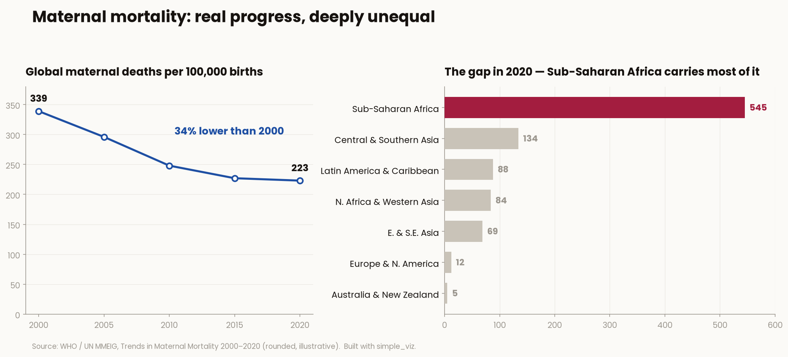
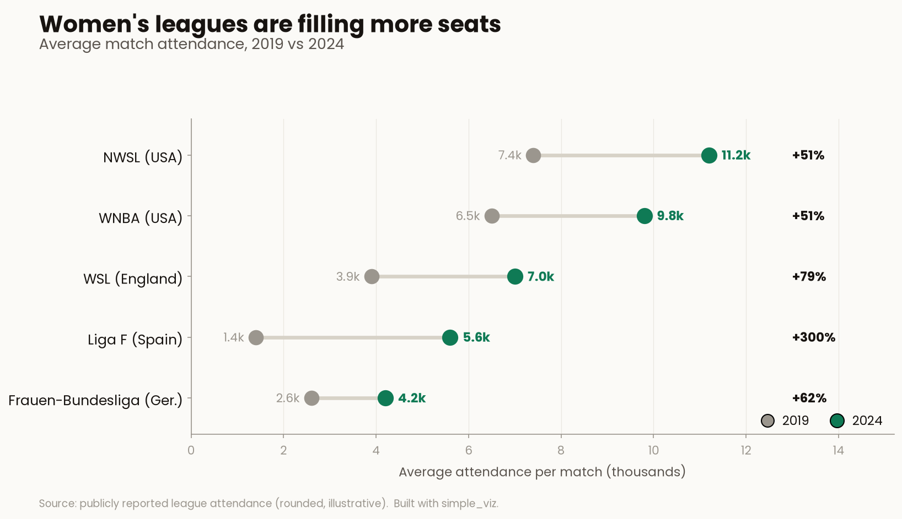

# simple_viz

A small, opinionated visualization library built on [matplotlib](https://matplotlib.org/).
Get a good-looking, colorblind-aware chart in one line — the palette, fonts, and
chrome are styled for you on import.

## Install

```bash
pip install simple-viz-aastha
```

Requires Python 3.8+ and matplotlib 3.5+. (Import the package as `simple_viz`.)

## Usage

Every chart function takes your data first, plus optional `title` / `xlabel` /
`ylabel` / `ax` / `save` keywords, and returns the matplotlib `Axes`. Columns of
a pandas `DataFrame` work directly:

```python
import pandas as pd
import simple_viz as sv

df = pd.DataFrame({
    "month":   ["Jan", "Feb", "Mar", "Apr"],
    "signups": [120, 145, 138, 172],
})

# Vertical bar chart
sv.bar(df["month"], df["signups"], title="Signups by month", ylabel="Signups")

# Line chart, saved to a file
sv.line(df["month"], df["signups"], title="Signup trend", save="trend.png")
```

The theme is applied automatically when you `import simple_viz`.

## Chart types

| Function | What it draws |
|----------|---------------|
| `bar(labels, values)`      | Vertical bar chart |
| `barh(labels, values)`     | Horizontal bar chart |
| `line(x, y, labels=...)`   | Line chart, single or multiple series |
| `scatter(x, y)`            | Scatter plot |
| `hist(values, bins=...)`   | Histogram |
| `pie(labels, values)`      | Pie chart |

## Example visualizations

Two worked figures (in `examples/`) apply the theme to real datasets:



*Women's health — the global maternal-mortality decline (2000–2020) alongside the stark regional gap, with Sub-Saharan Africa highlighted.*



*Sports — a dumbbell chart of women's-league average match attendance, 2019 vs 2024, showing double-digit growth across every league.*

Regenerate them with `python examples/maternal_health.py` and
`python examples/womens_sports.py`. Figures use rounded, illustrative public data.

## License

MIT
